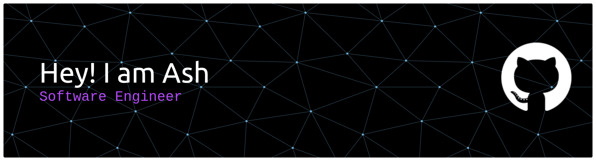

<h1>
   
  Hi, I'm <a href="https://ash-portfoliov3.vercel.app/"> Ash</a>!
  
</h1>

- 🌏 Based in **Philippines, Bohol**
- 💼 I’m currently working as **a Jr. Software Engineer at ACE Medical Center - Bohol**
- 🤝 I’m available for freelance projects. **You can reach me at ashgesite25@gmail.com**
- 👨‍💻 All of my projects are available at **[https://ash-portfoliov3.vercel.app/](https://ash-portfoliov3.vercel.app/)**

  

---

### 🌐 Web Development

  
  
  
  
  
  
  
  
  
  
  
  
  
  

---

### 🧰 Tools

  
  
  
  
  
  
  
  
  
  
  

---

### 🤖 Embedded Systems

  
  
  
  

---

  
  

